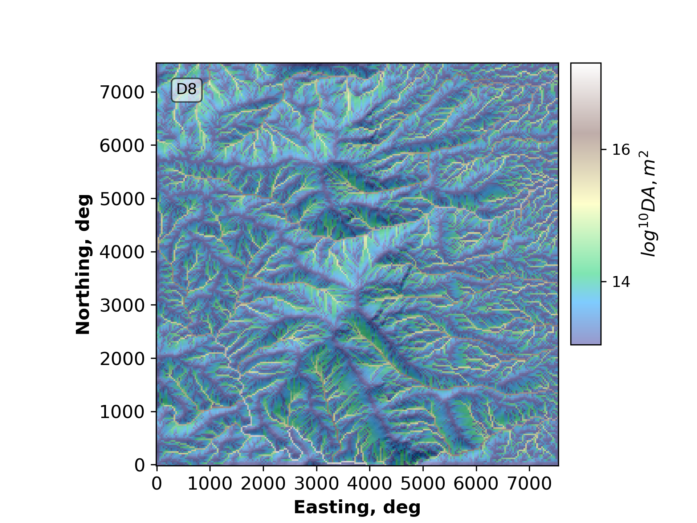

# ESPIn_Channel_Evolution_Group_2025

Contributors (listed in the alphabetic order of last name): 
- **Ekta Aggarwal**              *(University of Southhampton, UK)*
- **Leia Barnes**                *(LeHigh University, Bethlehem, PA)
- **Morgan Carrington**          *(The University of Texas at Austin, Austin, TX)*
- **Caroline Mierzejewski**      *(Texas State University, San Marcos, TX)*
- **Prakash Pokhrel**            *(University of Glasgow, UK)*

This is an ESPIn Repository for the ESPIn 2025 Channel Routing and Evolution (formerly known as the Floods Group) team project:
Precipitation aids in eroding landscapes creating new channels and causing others to migrate across floodplains. When discharge increases in the channel, due to frequent rainfall events, sediment transport will increase until the flow velocity decreases, changing the evolution of the channels.

By default, Landlab directs flow and accumulates it using FlowDirectors and FlowAccumulator. The downside to the above components is that they rely on the shallow water equation, something important to note when dealing with large precipitation events that lead to flooding. 

This notebook is meant to introduce how LandLab can be used for landscape evolution in response to fluvial erosion, especially made for audiences new to numerical modelling and/or landscape evolution (i.e., undergraduate students, LandLab crash course workshop, etc.). It covers a wide, but broad, example of how to achieve this in simulated or real landscapes and aims to show how one component can be investigated alone (lateral migration) or multiple can be incorporated to see combined effects (precipitation/rainfall, infiltration, incision).
